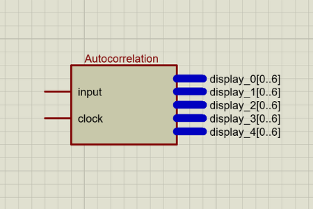
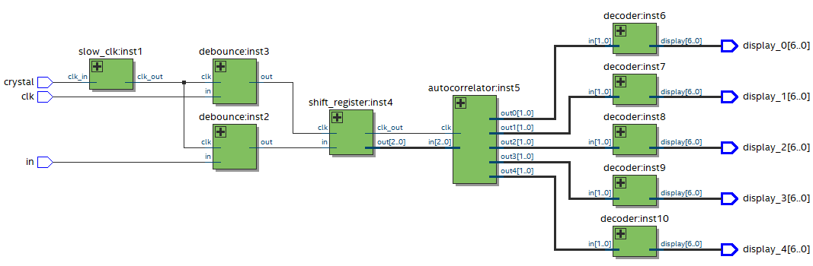
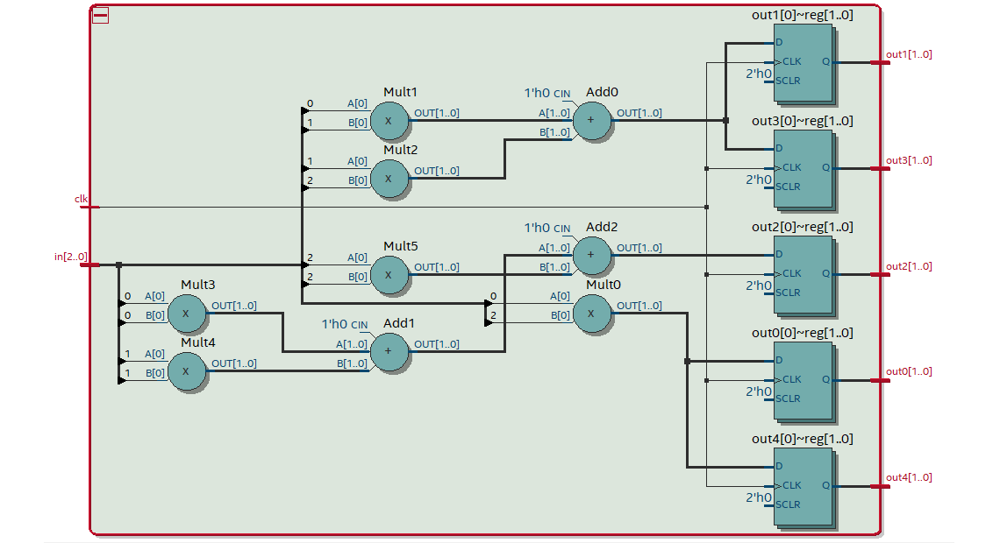

# Autocorrelation project

## Top-level entity

This entity was assembled in a .BDF file from other blocks, such as ***Shift Register***, ***Autocorrelator***, and ***Decoder***.

RTL view:

## Shift Register

The ***Shift Register*** transforms a serial input into 3 separate outputs, where ***out[0]*** receives the least significant bit and ***out[2]*** receives the most significant bit.

The output is released after every 3 inputs clocks.

***Clk_out*** is activated each time the output is loaded, serving as a clock for the next blocks.

NOTE: the ***always*** block is sensitive to the falling edge of the clock because, in the FPGA used for the tests, the button used to represent the clock has a ***pull-up resistor***, keeping it in **HIGH** when not pressed.

~~~verilog
module shift_register (in, clk, out, clk_out);
    input in;
    input clk;
    output reg [2:0]out;
    output reg clk_out;
  
    integer i = 2;
    integer y = 0;
    reg [2:0]hold;
  
    always @ (negedge clk) begin
        hold[i] <= in;
        if (i == 1'b0) begin
            i = 2;
            for(y = 0; y < 3; y = y + 1) begin
                out[y] <= hold[y];
            end
		clk_out <= 1;
        end else begin
            i <= i - 1;
	    clk_out <= 0;
        end 
    end
endmodule
~~~

RTL view:

## Autocorrelator

This block makes the autocorrelation between the input signal with itself shifted in time.

The input is a 3-bit vector, which represents the serial input signal, and the outputs are 5 vectors of 2 bits each, which represent the autocorrelation in binary. 

NOTE: the logic used was made in C++ and then adapted for Verilog, to facilitate the writing of ideas.

~~~verilog
module autocorrelator (in, clk, out0, out1, out2, out3, out4);
    input wire [2:0] in;
    input wire clk;
    output reg [1:0]out0;
    output reg [1:0]out1;
    output reg [1:0]out2;
    output reg [1:0]out3;
    output reg [1:0]out4;
	
    reg [1:0] hold;
    reg [1:0] hold2[5];
  
    integer i;
    integer diffe;
    integer y;
  
    always @ (posedge clk) begin
        for(i = 0; i < 5; i = i + 1) begin
            hold = 0;
            diffe = 0;
       
            if(i < 3) begin
                diffe = 2 - i;
                for(y = 0; y <= i; y = y + 1) begin
                    hold = hold + (in[y] * in[diffe]);
                    diffe = diffe + 1;
                end
            end else begin
                hold = hold2[4 - i];
            end
       
            hold2[i] = hold;
            hold = 0;
        end
	
	out0 = hold2[0];
	out1 = hold2[1];
	out2 = hold2[2];
	out3 = hold2[3];
	out4 = hold2[4];
    end

endmodule
~~~

RTL view:

## Decoder

The ***Decoder*** is used to transform the output in bits from the ***Autocorrelator*** to a seven-segment display.

For each 2-bit output of the ***Autocorrelator***, one ***Decoder*** is used.

~~~verilog
module decoder(in, display);
    input [1:0] in;
  
    output reg [6:0] display;
  
    always @ (in) begin
        if (in == 2'b00) begin             // 0
            display <= 7'b1111110;         // abcdef0
       
        end else if (in == 2'b01) begin    // 1
  	    display <= 7'b0110000;         // 0bc0000
       
        end else if (in == 2'b10) begin    // 2
  	    display <= 7'b1101101;         // ab0de0g
       
        end else if (in == 2'b11) begin    // 3
  	    display <= 7'b1111001;         // abcd00g  
        end
    end

endmodule
~~~

RTL view:

## Contact me
  
