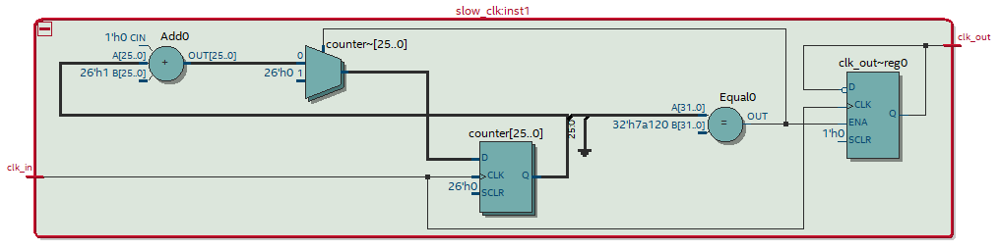
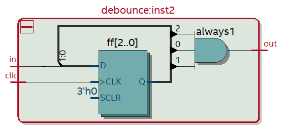

# Cross-correlation project

## Top-level entity

This entity was assembled in a .BDF file from other blocks, such as ***Slow Clock***, ***Debounce***, ***Shift Register***, ***Cross-Correlator*** and ***Decoder***.

RTL view:

## Slow Clock

The ***Slow Clock*** receives a 50 MHz clock input from the built-in crystal oscillator and transforms it into a 50 Hz clock output to be used on the Debounce circuit as a base clock.

Verilog code:

~~~verilog
module slow_clk(clk_in, clk_out);
    input clk_in;
    output clk_out;
	
    reg [25:0] counter = 0;
	
    always @ (posedge clk_in) begin
        counter <= counter + 1;
	if (counter == 500_000) begin
	    counter <= 0;
	    clk_out <= ~clk_out;
	end 
    end
endmodule
~~~

RTL view:

## Debounce

The ***Debounce*** circuit was made the avoid the bouncing effect of any mechanical button.

The way it works is bypassing the input signal through three *FlipFlops* and then comparing the output of each *FlipFlop* using an *AND* logic gate. The result of the logic gate will be the output of the circuit.

Verilog code:

~~~verilog
module debounce(in, clk, out);
    input in;
    input clk;
    output reg out;
	
    reg [2:0] ff;
	
    always @ (posedge clk) begin
        ff[2] = ff[1];
        ff[1] = ff[0];
        ff[0] = in;
    end
	
    always begin
        if (ff[0] && ff[1] && ff[2]) begin
            out <= 1'b1;
        end else begin
            out <= 1'b0;
        end
    end
endmodule
~~~

RTL view:

## Shift Register

The ***Shift Register*** transforms a serial input into 3 separate outputs, where ***out[0]*** receives the least significant bit and ***out[2]*** receives the most significant bit.

The output is released after every 3 inputs clocks.

In this project, two ***Shift Registers*** were used. One for each input signal.

***Clk_out*** is activated each time the output is loaded, serving as a clock for the next blocks.

Verilog code:

~~~verilog
module shift_register (in, clk, out, clk_out);
    input in;
    input clk;
    output reg [2:0]out;
    output reg clk_out;
  
    integer i = 2;
    integer y = 0;
    reg [2:0]hold;
  
    always @ (posedge clk) begin
        hold[i] = in;
        if (i == 1'b0) begin
            i <= 2;
            for(y = 0; y < 3; y = y + 1) begin
                out[y] = hold[y];
            end
            clk_out = 1; 
        end else begin
            i <= i - 1;
            clk_out <= 0;
        end 
    end
endmodule
~~~

RTL view:

## Cross-correlator

This block correlates two input signals.

The inputs are two vectors of 3 bits, which represent the signals of the serial input, and the outputs are 5 vectors of 2 bits each, which represent the cross-correlation in binary.

NOTE: the logic used was made in C++ and then adapted for Verilog, to facilitate the writing of ideas.

Verilog code:

~~~verilog
module cross_correlator(in1, in2, clk, out0, out1, out2, out3, out4);
    input [2:0]in1;
    input [2:0]in2;
    input wire clk;
  
    output reg [1:0]out0;
    output reg [1:0]out1;
    output reg [1:0]out2;
    output reg [1:0]out3;
    output reg [1:0]out4;
  
    reg [1:0]hold[5:0];
  
    integer i = 0;
    integer y = 0;
    integer diffe = 0;
  
    always @ (posedge clk) begin
        for (i = 0; i < 5; i = i + 1) begin
            if (i < 3) begin
                diffe = 2 - i;
                for (y = 0; y <= i; y = y + 1) begin
                    hold[i] = hold[i] + (in1[y] * in2[diffe + y]);
                end
            end else begin
                diffe = i - 2;
                for (y = 0; y < (5 - i); y = y + 1) begin
                    hold[i] = hold[i] + (in1[diffe + y] * in2[y]);
                end
            end
        end
        out0 = hold[0];
        out1 = hold[1];
        out2 = hold[2];
        out3 = hold[3];
        out4 = hold[4];
        hold[0] = 1'b0;
        hold[1] = 1'b0;
        hold[2] = 1'b0;
        hold[3] = 1'b0;
        hold[4] = 1'b0;
   end
endmodule
~~~

RTL view:

## Decoder

The ***Decoder*** is used to transform the output in bits from the ***Cros-correlator*** to a seven-segment display.

For each 2-bit output of the ***Cross-correlator***, one ***Decoder*** is used.

Verilog code:

~~~verilog
module decoder(in, display);
    input [1:0] in;
  
    output reg [6:0] display;
  
    always @ (in) begin
        if (in == 2'b00) begin             // 0
            display <= 7'b1111110;         // abcdef0
       
        end else if (in == 2'b01) begin    // 1
            display <= 7'b0110000;         // 0bc0000
       
        end else if (in == 2'b10) begin    // 2
            display <= 7'b1101101;         // ab0de0g
       
        end else if (in == 2'b11) begin    // 3
            display <= 7'b1111001;         // abcd00g  
        end
    end
endmodule
~~~

RTL view:

## Contact me
  
